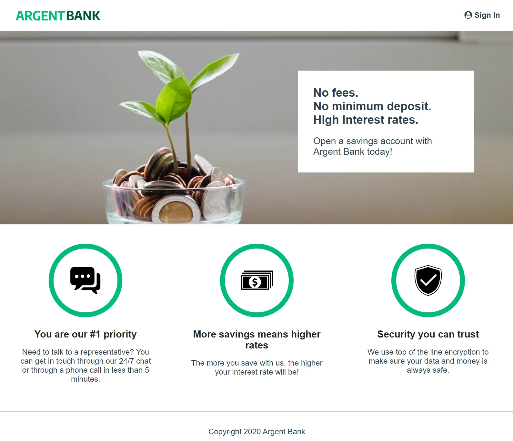

# ArgentBank

This codebase contains the code needed to run the frontend for Argent Bank.
<hr>
Project ArgentBank implements front-end for a banking website. Integrates functions like user authentification and transaction display, and uses React and Redux Toolkit for state management.


&nbsp;
&nbsp;
<hr>

## Getting Started

### Prerequisites

Argent Bank frontend uses the following tech stack:

-   [Node.js v20.2.0](https://nodejs.org/en/)
-   [TypeScript v5.1.3](https://www.typescriptlang.org/)
-   [React v18.2.0](https://react.dev/)
-   [ReactDOM v18.2.0](https://react.dev/reference/react-dom)
-   [React RouterDOM v6.11.2](https://reactrouter.com/en/main)
-   [React Redux v8.0.5](https://react-redux.js.org/)
-   [Redux Toolkit v1.9.5](https://redux-toolkit.js.org/)
-   [Redux Persist v6.0.0](https://github.com/rt2zz/redux-persist)
-   [React Icons v4.9.0](https://react-icons.github.io/react-icons/)

### Instructions to run the frontend

1. Fork this repo
2. Clone the repo onto your computer
3. Open a terminal window in the cloned project
4. Run the following commands:

```bash
# Install dependencies
npm install

# Start the frontend
npm run dev
```

Your application will be now accessible on the localhost: http://localhost:5173/

### Instructions to run the backend can be found here

-   [Argent Bank backend](https://github.com/OpenClassrooms-Student-Center/ArgentBank-website/blob/main/README.md)
